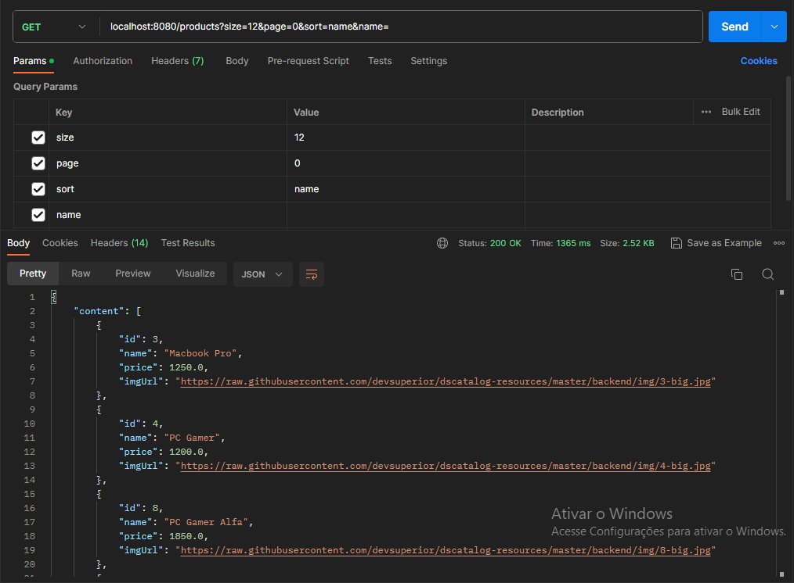

# yseCommecer
[](https://github.com/Yse4/yseCommecer/blob/main/LICENSE) 

# Sobre o projeto
JavaCommecer é uma aplicação que consiste em uma API back-end que disponibiliza recursos de comércio como busca de produtos e suas categorias, registro de usuários e registro de pedidos.

# Modelo Conceitual


# Tecnologias utilizadas

## Back-end
* Java
* Spring
* Jpa/Hibernate
* Maven

## Implantação em produção
* Back-end: Heroku

# End Points

## Produtos
* `GET products`: Busca paginada dos produtos
* `GET products by id`: Retorna um produto pelo seu id
* `POST products`: Insere um produto no banco de dados (Somente admim)
* `PUT product by id`: Atualiza um produto pelo id (Somente admim)
* `DELETE product by id`: Deleta um produto pelo id (Somente admim)

## Usuários
* `GET users/me`: Retorna o usuário logado no momento
* `POST users/register`: Registra um usuário

## Pedidos
* `GET orders by id`: Retorna um pedido pelo seu id (Somente admim)
* `POST order`: Registra um pedido

## Postman


# Como executar o projeto

## Back-end

Pré-requisitos: Java 17

```bash
# clonar repositório
git clone https://github.com/Yse4/yseCommecer

# entrar na pasta do projeto back end
cd backend

# executar o projeto
./mvnw spring-boot:run
```
# Autor
Ualas Henrique Bezerra Filho

https://www.linkedin.com/in/ualas-henrique-54678827a/
